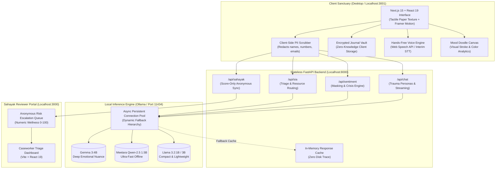

# ZenGuard AI (ADHARA)
> **Privacy-First Offline Trauma-Informed Counseling & Real-Time Emotional Resilience Platform**

[](https://opensource.org/licenses/MIT)
[](https://www.python.org/)
[](https://fastapi.tiangolo.com/)
[](https://nextjs.org/)
[](https://react.dev/)
[](https://ollama.com/)
[](#zero-knowledge-privacy-architecture)
[](https://github.com/useriswild7099/ZEN)

ZenGuard AI  is a high-performance, edge-computing mental health and trauma-informed recovery platform designed to provide private, culturally grounded psychological support, somatic grounding, and crisis de-escalation. By executing local-first Large Language Models (LLMs) on-device via **Ollama**, ZenGuard AI delivers clinical-grade conversational support, emotional masking detection, and somatic nervous system stabilization with **absolute privacy**—no data, conversation transcripts, or journal entries ever leave your computer.

---

Core Highlights & Architectural Pillars

```
 ┌────────────────────────────────────────────────────────────────────────┐
 │                         ZenGuard AI (ADHARA)                           │
 │                                                                        │
 │  100% Offline Edge AI        5 Specialized Personas   Sahayak Sync     │
 │  Ollama local neural weights  Trauma & Rights Support  Score-Only Triage│
 │                                                                        │
 │  Tactile Paper Texture UI    Client-Side PII Scrub    Encrypted Vault  │
 │  Calming Organic Sanctuary    Zero-Trace In-Memory     Local Key Lock   │
 └────────────────────────────────────────────────────────────────────────┘
```

- **Zero-Cloud Data Sovereignty**: All emotional analysis and conversational inferences run locally on hardware via Ollama. No remote telemetry, no external API keys, and zero vendor lock-in.
- **5 Specialized Trauma Therapy Personalities**:
  -  **Dost (Saathi)**: Compassionate trauma companion & emotional anchor.
  -  **Margdarshak**: Structured guidance counselor & step-by-step psychological stabilizer.
  -  **Prahari**: Rights protection navigator & survivor empowerment counselor.
  -  **Vaidya**: Somatic grounding expert & mind-body nervous system stabilizer.
  -  **Apna Saathi**: Fully customizable, user-tailored recovery companion.
- **Multilingual Support for 18+ Indian Languages**: Native script and Romanized code-switching support across Hindi, Hinglish, Bengali, Marathi, Telugu, Tamil, Gujarati, Kannada, Punjabi, Odia, Assamese, Urdu, and English.
- **Somatic & Sensory Grounding Suite**:
  - Interactive **Box Breathing** with visual pacing.
  - **5-4-3-2-1 Sensory Grounding** for acute panic de-escalation.
  - **Mood Doodle Canvas**: Multimodal non-verbal expression translating strokes and color psychology into emotional cues.
- **Statutory Safeguards & Helpline Integration**: Constant surfacing of verified 24×7 national helplines:
  - **Tele-MANAS**: `14416` (National Mental Health Helpline — Toll-free, 24×7, multi-language).
  -  **NALSA**: `15100` (National Legal Services Authority — Free legal aid).
- **Dual-System Architecture with Sahayak Dashboard**:
  - **ZenGuard Client**: Privacy-first personal sanctuary for the user.
  - **Sahayak Reviewer Portal**: Professional triage interface receiving strictly anonymous, numeric-only wellness scores (0-100) with zero conversation transcripts or PII.

---

## System Architecture



---

## Quick Start (Automated & Manual)

### Option 1: Automated 1-Click Launch (Recommended)

ZenGuard AI includes self-contained bootstrap wizards that automatically initialize all services (Ollama, Backend, ZenGuard Client, and Sahayak Dashboard).

#### Windows
```powershell
# 1. Run the automated installer wizard (installs missing packages)
install.bat

# 2. Launch all services simultaneously with one click
start.bat
```

#### Linux & macOS
```bash
chmod +x install.sh start.sh
./install.sh
./start.sh
```

Once started:
-  **ZenGuard Sanctuary**: `http://localhost:3001`
-  **Sahayak Caseworker Portal**: `http://localhost:3000`
-  **FastAPI Backend**: `http://127.0.0.1:8000`
-  **Local Ollama Inference**: `http://127.0.0.1:11434`

---

### Option 2: Manual Developer Setup

#### 1. Prerequisites
- **[Ollama](https://ollama.com/)** (Local LLM runner)
- **[Python 3.10+](https://www.python.org/downloads/)**
- **[Node.js 18+](https://nodejs.org/)** & `npm`

#### 2. Pull Local AI Models
Download one or more recommended models via Ollama:
```bash
# Recommended for standard hardware:
ollama pull gemma3:4b

# Lightweight model for laptops / low VRAM:
ollama pull llama3.2:1b

# High-speed compact model:
ollama pull qwen2.5:1.5b
```

#### 3. Backend Setup (FastAPI)
```bash
cd backend

# Create & activate Python virtual environment
python -m venv venv

# Windows:
venv\Scripts\activate
# Linux/macOS:
source venv/bin/activate

# Install dependencies
pip install -r requirements.txt

# Start FastAPI server on port 8000
python -m uvicorn main:app --reload --port 8000
```

#### 4. ZenGuard Frontend Setup (Next.js 15)
```bash
cd frontend
npm install
npm run dev -- -p 3001
```
*Open `http://localhost:3001` in your browser.*

#### 5. Sahayak Reviewer Dashboard (Optional)
```bash
cd sahayak-dashboard
npm install
npm run dev -- --port 3000
```
*Open `http://localhost:3000` in your browser.*

---

##  Zero-Knowledge Privacy Architecture

ZenGuard AI was built from first principles around digital sovereignty and survivor safety:

1. **Client-Side PII Scrubbing**: Names, dates, addresses, phone numbers, and identity tokens are stripped in the client browser before payload transmission.
2. **Stateless Backend**: The backend has zero database drivers, no SQLite, no PostgreSQL, and no cloud bucket storage. Every request is processed ephemerally in RAM and promptly released.
3. **Zero Request Body Logging**: Standard HTTP request logging (`uvicorn.access`) is explicitly disabled in `backend/main.py` to prevent accidental persistence of personal thoughts.
4. **Client-Side Encrypted Journal Vault**: Journal reflections are encrypted directly on the client with zero cloud synchronization.
5. **Score-Only Professional Escalation**: The Sahayak Caseworker portal receives solely anonymous mathematical scores (wellness band, distress index, escalation timestamp). Textual content NEVER leaves the user's computer.

---

## Cloud Deployment & Vercel Fallback

When accessed via a cloud deployment (such as Vercel) where local Ollama hardware is not directly reachable:
- The landing page, somatic tools (Box Breathing, 5-4-3-2-1 Grounding), Mood Doodle canvas, and statutory helpline directories remain fully functional in the browser.
- If a user initiates chat in cloud mode, the system warmly informs them of ZenGuard's strict **zero-cloud privacy architecture**, provides instant links to verified 24×7 national helplines (**Tele-MANAS: 14416**, **NALSA: 15100**), and directs them to download the desktop application from [GitHub](https://github.com/useriswild7099/ZEN) for 100% offline, private conversation.

---

##  Project Directory Structure

```
ADHARA/
├── backend/
│   ├── models/             # Pydantic schemas (Sentiment, Chat, SIA, Sahayak)
│   ├── privacy/            # Client/Server PII detection & anonymization helpers
│   ├── routers/
│   │   ├── chat.py         # Multi-model chat & streaming completions
│   │   ├── sentiment.py    # Sentiment & emotional masking analytics
│   │   ├── sia.py          # Clinical triage navigator
│   │   ├── journal.py      # Ephemeral journal processing
│   │   └── sahayak.py      # Score-only anonymous caseworker sync
│   ├── services/
│   │   ├── ollama_client.py# Persistent local Ollama connection pool
│   │   ├── crisis_detector.py # Crisis keyword triage & safety protocols
│   │   ├── wellness_score.py # 18+ Language distress & wellness engine
│   │   └── sahayak_sync.py # Reviewer queue synchronization
│   ├── trauma_persona.py   # 5 Specialized trauma therapy personas
│   ├── main.py             # FastAPI entrypoint & privacy configuration
│   └── requirements.txt    # Python dependencies
├── frontend/               # ZenGuard User Client (Next.js 15 + React 19)
│   ├── public/             # Paper textures and visual assets
│   ├── src/
│   │   ├── app/            # App router with universal paper grain theme
│   │   ├── components/     # React component suite (Chat, Doodle, Vault, Grounding)
│   │   └── lib/            # Multilingual translations & API clients
│   └── package.json
├── sahayak-dashboard/      # Caseworker Reviewer Portal (Vite + React 19)
│   ├── src/                # Anonymous risk triage queue & score analytics
│   └── package.json
├── PERSONA_REGISTRY.md     # Detailed documentation of therapeutic personas
├── start.bat / start.sh    # Unified multi-service 1-click startup scripts
├── install.bat / install.sh# Automated dependency installers
└── LICENSE                 # Open-source MIT License
```

---

##  Verification & Test Suite

The backend includes a comprehensive 30-case automated test suite verifying trauma persona integrity, crisis detector protocols, 18+ language wellness scoring, and anonymous Sahayak score synchronization:

```bash
cd backend
python -m pytest tests/test_zenguard_customization.py -v
```

---

## 📄 License

Distributed under the **MIT License**. See `LICENSE` for details.

---
*ZenGuard AI (Project ADHARA) — Transforming emotional resilience through local edge computing, open models, and uncompromising privacy.*
